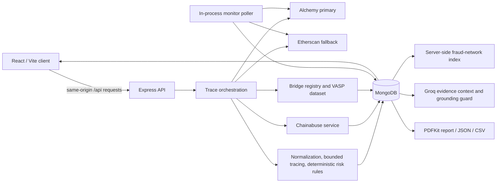

# TraceX architecture — Phase 0 audit

## Runtime stack

| Layer | Current implementation |
|---|---|
| Client | React 19, Vite 6, client-side routing built on History API |
| API | Node.js, Express 5 |
| Persistence | MongoDB via Mongoose 8 |
| Blockchain data | Alchemy Asset Transfers primary; Etherscan V2 fallback |
| Threat intelligence | Chainabuse server-side service with MongoDB cache |
| Copilot | Groq server-side service with an evidence-building/grounding guard |
| Documents | PDFKit server-generated PDF report; JSON/CSV exports |
| Monitoring | In-process polling interval in `backend/server.js` |
| Visualizations | Custom React/SVG/CSS graph and Intelligence Studio views; no graph/chart package |
| Tests | Node built-in test runner, backend service tests, frontend utility tests |

## Data flow

## Primary stored records

- Investigation: provider-normalized result JSON and case metadata.
- CaseNetworkIndex: derived shared-infrastructure index for cross-case correlation.
- Monitor and Alert: monitored wallets and created alerts.
- EvidenceItem: canonical snapshot plus integrity hash.
- InvestigatorNote and InvestigatorFinding: case-work records.
- DeveloperApiKey: key ID, scopes, expiry/status, and a SHA-256 secret hash only.
- ThreatIntelligenceCache: Chainabuse response cache.

## Routing

- Public intro: `/` and `/investigate`.
- Case workspace: `/cases/:id`, with an internal `?tab=` query selector.
- Operational routes: `/network`, `/monitoring`, `/alerts`, `/investigators`, `/copilot`, `/reports`, `/developers`, `/system`.
- Versioned developer API: `/v1/cases/:caseId`, `/network`, and `/workspace`, protected by `X-TraceX-Key` scopes.

## Security boundary observed

Provider credentials are read by server-side services from environment variables. The browser receives provider configuration state, not provider secret values. The developer-key console receives a newly-created TraceX API secret once, then the server stores only its hash.

## Audit constraints

The in-app browser automation surface was unavailable in this session, so Phase 0 UI interaction results are marked as unverified rather than assumed. HTTP endpoint checks and source inspection were performed against the local running stack.
